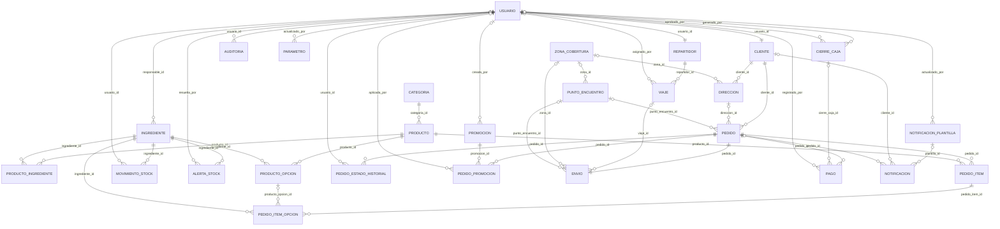
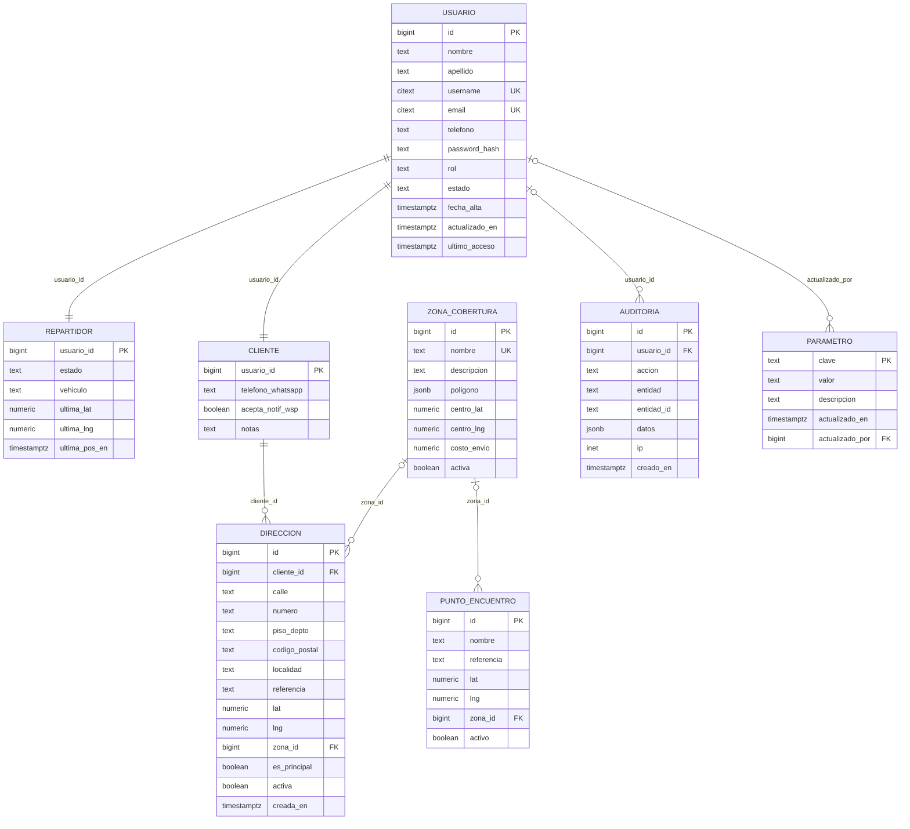
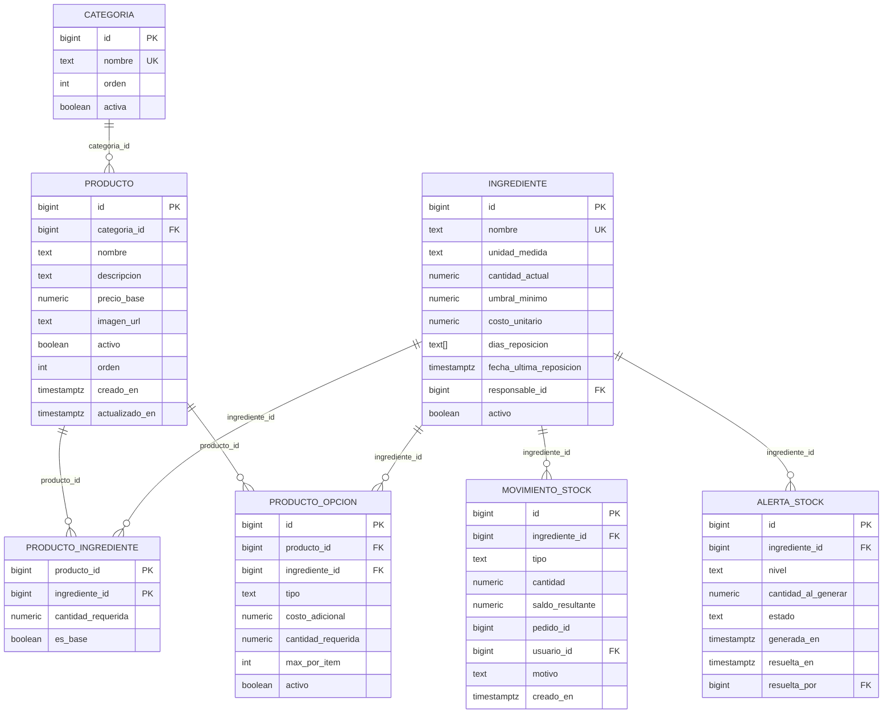
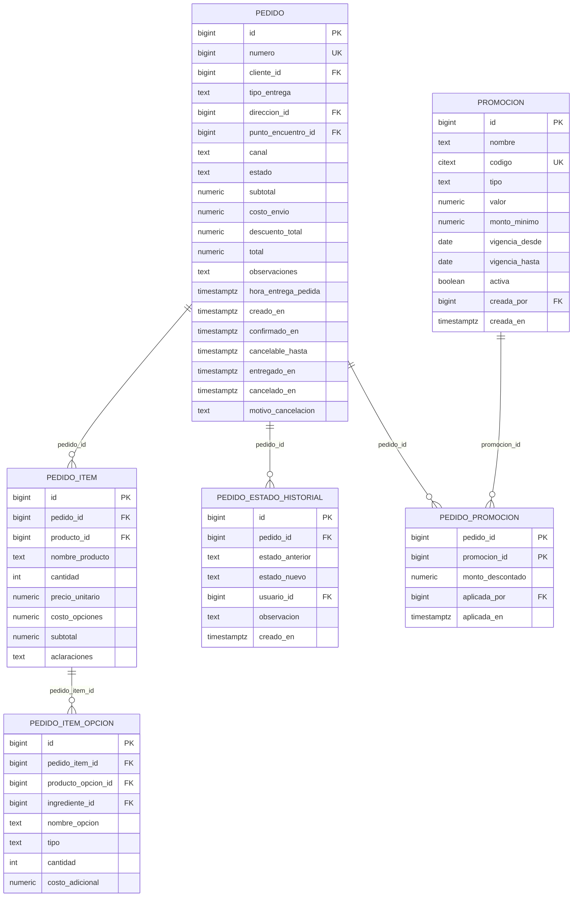
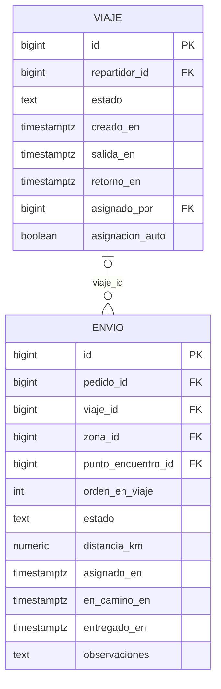
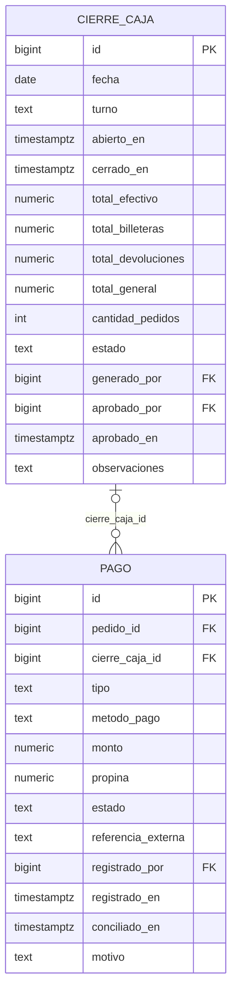
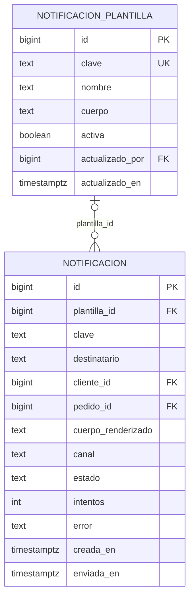

# Diagrama Entidad-Relación — Monu Burger

Modelo de datos **tal como está implementado** en la base.

> **Generado automáticamente** con `python -m scripts.der` a partir de
> `App/db/migrations/`. No editar a mano: al derivarse del SQL, no puede
> quedar desactualizado respecto del esquema real. CI verifica que
> este al dia.

**27 entidades · 46 relaciones.**

Este diagrama reemplaza al entregado en la Actividad N°2: las diferencias
están explicadas una por una en [CAMBIOS_DER.md](CAMBIOS_DER.md) (C-01 a C-12).

## Cómo leer la notación

| Símbolo | Significado |
|---------|-------------|
| `\|\|--o{` | uno a muchos (la relación es obligatoria) |
| `o\|--o{` | uno a muchos (la clave foránea admite nulos) |
| `\|\|--\|\|` | uno a uno |
| `PK` | clave primaria · `FK` clave foránea · `UK` valor único |

---

## Diagrama general

Entidades y relaciones, sin atributos.

---

## Diagramas por módulo

### Usuarios y seguridad

### Catalogo y stock

### Pedidos

### Delivery

### Pagos y caja

### Notificaciones

---

## Relaciones en detalle

| Desde | Clave foránea | Hacia | Cardinalidad | Obligatoria |
|-------|---------------|-------|--------------|-------------|
| `alerta_stock` | `ingrediente_id` | `ingrediente` | 1 : N | Sí |
| `alerta_stock` | `resuelta_por` | `usuario` | 1 : N | No |
| `auditoria` | `usuario_id` | `usuario` | 1 : N | No |
| `cierre_caja` | `aprobado_por` | `usuario` | 1 : N | No |
| `cierre_caja` | `generado_por` | `usuario` | 1 : N | No |
| `cliente` | `usuario_id` | `usuario` | 1 : 1 | Sí |
| `direccion` | `cliente_id` | `cliente` | 1 : N | Sí |
| `direccion` | `zona_id` | `zona_cobertura` | 1 : N | No |
| `envio` | `pedido_id` | `pedido` | 1 : 1 | Sí |
| `envio` | `punto_encuentro_id` | `punto_encuentro` | 1 : N | No |
| `envio` | `viaje_id` | `viaje` | 1 : N | No |
| `envio` | `zona_id` | `zona_cobertura` | 1 : N | No |
| `ingrediente` | `responsable_id` | `usuario` | 1 : N | No |
| `movimiento_stock` | `ingrediente_id` | `ingrediente` | 1 : N | Sí |
| `movimiento_stock` | `usuario_id` | `usuario` | 1 : N | No |
| `notificacion` | `cliente_id` | `cliente` | 1 : N | No |
| `notificacion` | `plantilla_id` | `notificacion_plantilla` | 1 : N | No |
| `notificacion` | `pedido_id` | `pedido` | 1 : N | No |
| `notificacion_plantilla` | `actualizado_por` | `usuario` | 1 : N | No |
| `pago` | `cierre_caja_id` | `cierre_caja` | 1 : N | No |
| `pago` | `pedido_id` | `pedido` | 1 : N | Sí |
| `pago` | `registrado_por` | `usuario` | 1 : N | No |
| `parametro` | `actualizado_por` | `usuario` | 1 : N | No |
| `pedido` | `cliente_id` | `cliente` | 1 : N | Sí |
| `pedido` | `direccion_id` | `direccion` | 1 : N | No |
| `pedido` | `punto_encuentro_id` | `punto_encuentro` | 1 : N | No |
| `pedido_estado_historial` | `pedido_id` | `pedido` | 1 : N | Sí |
| `pedido_estado_historial` | `usuario_id` | `usuario` | 1 : N | No |
| `pedido_item` | `pedido_id` | `pedido` | 1 : N | Sí |
| `pedido_item` | `producto_id` | `producto` | 1 : N | Sí |
| `pedido_item_opcion` | `ingrediente_id` | `ingrediente` | 1 : N | Sí |
| `pedido_item_opcion` | `pedido_item_id` | `pedido_item` | 1 : N | Sí |
| `pedido_item_opcion` | `producto_opcion_id` | `producto_opcion` | 1 : N | No |
| `pedido_promocion` | `pedido_id` | `pedido` | 1 : N | Sí |
| `pedido_promocion` | `promocion_id` | `promocion` | 1 : N | Sí |
| `pedido_promocion` | `aplicada_por` | `usuario` | 1 : N | No |
| `producto` | `categoria_id` | `categoria` | 1 : N | Sí |
| `producto_ingrediente` | `ingrediente_id` | `ingrediente` | 1 : N | Sí |
| `producto_ingrediente` | `producto_id` | `producto` | 1 : N | Sí |
| `producto_opcion` | `ingrediente_id` | `ingrediente` | 1 : N | Sí |
| `producto_opcion` | `producto_id` | `producto` | 1 : N | Sí |
| `promocion` | `creada_por` | `usuario` | 1 : N | No |
| `punto_encuentro` | `zona_id` | `zona_cobertura` | 1 : N | No |
| `repartidor` | `usuario_id` | `usuario` | 1 : 1 | Sí |
| `viaje` | `repartidor_id` | `repartidor` | 1 : N | Sí |
| `viaje` | `asignado_por` | `usuario` | 1 : N | No |

---

## Para el informe

Los diagramas de arriba se renderizan solos en GitHub. Para pegarlos en el
documento de la entrega, copiar el bloque `mermaid` correspondiente en
[mermaid.live](https://mermaid.live) y exportarlo como PNG o SVG.
